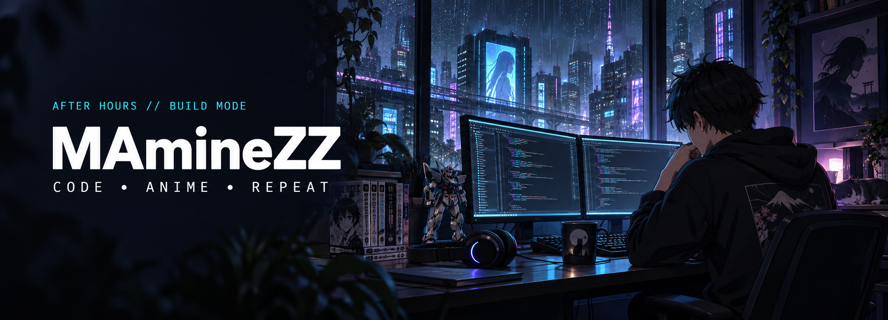
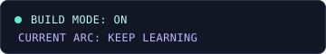
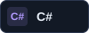
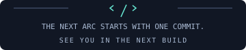

<p align="center">
  
</p>

<p align="center">
  
</p>

<h1 align="center">ZINDDINE Mohamed Amine</h1>

<p align="center">
  <b>Software Application Engineer · C# / .NET · React / TypeScript</b><br />
  Useful software. Better fundamentals. One more episode.
</p>

<p align="center">
  <a href="https://github.com/MAmineZZ?tab=repositories">Explore my repositories</a>
  &nbsp;·&nbsp;
  <a href="https://github.com/MAmineZZ/neetcode-submissions">Follow the training arc</a>
</p>

## ⌘ Player profile

I like understanding how things work, then building something useful with them. My focus is **C# / .NET and React / TypeScript**, with a growing interest in AI applications and the engineering behind them.

```csharp
var player = new
{
    Handle = "MAmineZZ",
    Class = "Software Application Engineer",
    MainQuest = "Turn ideas into useful software",
    TrainingArc = "DSA, system design, AI applications",
    SideQuests = new[] { "Anime", "Gaming", "Piano" },
    Motto = "Understand it. Build it. Level up."
};
```

## ⚡ My loadout

<p>
  
  
  
  
  
</p>

**Currently leveling up:** data structures and algorithms in C#, clean architecture, system design, and AI-assisted development.

## 🚀 Quest log

### [DevSecOps Copilot ↗](https://github.com/MAmineZZ/devsecops-copilot)

Building an AI-assisted code-review workspace with .NET and React.

`C#` `.NET` `React` `TypeScript` · **In progress**

### [Little Lemon ↗](https://github.com/MAmineZZ/react-capstone)

A restaurant interface built with React and TypeScript for the Meta Front-End Developer capstone.

`React` `TypeScript` `Styled Components` `Jest`

### [The training arc ↗](https://github.com/MAmineZZ/neetcode-submissions)

My C# data structures, algorithms, and NeetCode solutions. Getting better one problem at a time.

`C#` `DSA` `Problem solving`

## 🎮 Away from the keyboard… mostly

- **Anime:** always room for one more episode.
- **Gaming:** Valorant and League of Legends.
- **Music:** piano, synths, and music production.
- **Side projects:** turning a small idea into something I can actually use.

<br />

<p align="center">
  
</p>

