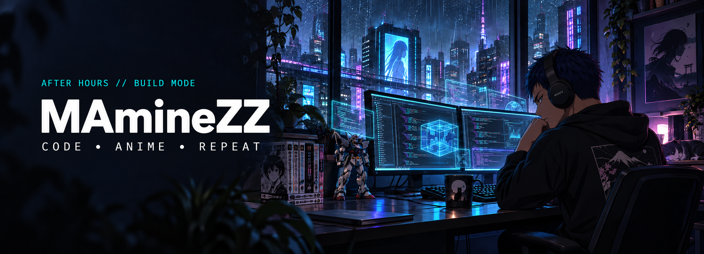
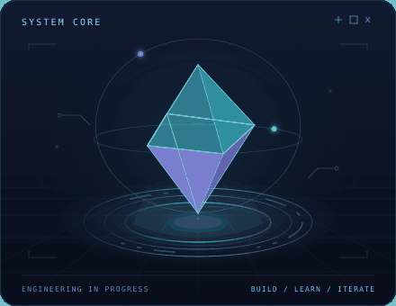

<p align="center">
  
</p>

# ZINDDINE Mohamed Amine

**Software Application Engineer · C# / .NET · React + TypeScript · AI tooling**

<p>
  <a href="#user-content-development-stack">Development stack</a> &nbsp; / &nbsp;
  <a href="#user-content-selected-projects">Selected projects</a> &nbsp; / &nbsp;
  <a href="#user-content-current-training-arc">Training arc</a> &nbsp; / &nbsp;
  <a href="https://github.com/MAmineZZ?tab=repositories">All repositories ↗</a>
</p>

<table>
<tr>
<td width="60%" valign="top">
<h3>Engineer by craft. Geek by default.</h3>
<p>I build full-stack projects to understand the systems behind them: how APIs enforce permissions, how interfaces manage state, and how software stays understandable as it grows.</p>
<p><b>Main focus</b><br />C# and .NET backends, React and TypeScript interfaces, and useful AI integrations.</p>
<p><b>Engineering interests</b><br />Clean architecture, application security, testable code, and developer tools.</p>
<p><b>Off-duty mode</b><br />Anime, Valorant, League of Legends, and the next side project.</p>
</td>
<td width="40%" align="center" valign="middle">
<picture>
  <source media="(prefers-reduced-motion: reduce)" srcset="./assets/v2/system-core-still.svg" />
  
</picture>
<br />
<sub><a href="./assets/v2/system-core-still.svg">Static artwork</a></sub>
</td>
</tr>
</table>

<p align="center"></p>

## Development stack

<p align="center">
  
  
  
  
  
</p>

Technologies you'll find in my public projects:

| Layer | Technologies | What I'm building with them |
| :--- | :--- | :--- |
| **Backend** | C# · ASP.NET Core · EF Core · MediatR | Layered APIs, application logic, and data access |
| **Frontend** | React · TypeScript · Vite | Component-based interfaces and application state |
| **Data** | SQL Server · Redis | Relational persistence and cached review results |
| **Testing** | xUnit · Moq · Testcontainers · Vitest · React Testing Library | Unit, integration, and UI test suites |
| **Delivery** | Git · GitHub Actions · Docker | Version control, CI workflows, and reproducible environments |

## Selected projects

<table>
<tr>
<td colspan="2" valign="top">
<h3><a href="https://github.com/MAmineZZ/devsecops-copilot">DevSecOps Copilot ↗</a></h3>
<p><b>AI-assisted code review · Full-stack learning project · In progress</b></p>
<p>A GitHub-connected workspace for exploring code review, security checks, and AI-assisted development.</p>
<ul>
<li><b>Backend:</b> a layered .NET API with role-based permissions, audit endpoints, and verified webhook signatures.</li>
<li><b>Data flow:</b> EF Core with SQL Server, Redis caching, and AI review processing.</li>
<li><b>Interface:</b> React and TypeScript, with backend and frontend test suites in the repository.</li>
</ul>
<p><code>C#</code> <code>ASP.NET Core</code> <code>React</code> <code>SQL Server</code> <code>Redis</code></p>
</td>
</tr>
<tr>
<td width="50%" valign="top">
<h3><a href="https://github.com/MAmineZZ/react-capstone">Little Lemon ↗</a></h3>
<p><b>Frontend capstone · React + TypeScript</b></p>
<p>A restaurant website and booking flow built for the Meta Front-End Developer capstone.</p>
<p><b>Inside:</b> reusable components, Formik and Yup validation, Styled Components, and booking-form tests.</p>
<p><code>React</code> <code>TypeScript</code> <code>Jest</code></p>
</td>
<td width="50%" valign="top">
<h3><a href="https://github.com/MAmineZZ/neetcode-submissions">NeetCode practice ↗</a></h3>
<p><b>C# fundamentals · Problem solving</b></p>
<p>A growing collection of submissions covering Two Sum, Contains Duplicate, Valid Anagram, and Group Anagrams.</p>
<p><b>Focus:</b> correctness, complexity analysis, and choosing suitable data structures.</p>
<p><code>C#</code> <code>Arrays</code> <code>Strings</code> <code>Hash maps</code></p>
</td>
</tr>
</table>

<details>
<summary><b>Open the engineering notebook</b></summary>
<br />

Questions I keep returning to while building:

- **Boundaries:** which layer should own this behaviour?
- **Security:** is access checked at the API, and can incoming events be trusted?
- **Testing:** which test would catch a real failure here?
- **AI:** does the feature solve a useful problem, and can its behaviour be checked?
- **Maintainability:** will the next change be straightforward to understand?

DevSecOps Copilot is a learning and portfolio project. Its repository documents implementation and experiments; the description above isn't a claim of production deployment or a current test pass rate.

</details>

## Current training arc

| Focus | What I'm working on |
| :--- | :--- |
| **C# / .NET** | Stronger language fundamentals and clearer backend design |
| **React / TypeScript** | Reusable components, state management, and accessible interfaces |
| **DSA** | Arrays, strings, hash maps, and time/space complexity |
| **Architecture** | Separation of concerns, authentication, caching, and testing |
| **AI engineering** | Integrations with useful and testable behaviour |

<details>
<summary><b>Load developer.config.cs</b></summary>

```csharp
var developer = new
{
    Handle = "MAmineZZ",
    Focus = new[] { "C#", ".NET", "React", "TypeScript" },
    Interests = new[] { "AI tooling", "Anime", "Gaming" },
    Approach = "Understand it. Build it. Improve it."
};
```

</details>

---

<p align="center">
  <b>Build with intent. Keep learning. Enjoy the next episode.</b><br />
  <sub>Anime enthusiast · Valorant · League of Legends</sub>
</p>
